<picture>
  <source media="(prefers-color-scheme: dark)" srcset="assets/terminal-dark.svg">
  <source media="(prefers-color-scheme: light)" srcset="assets/terminal-light.svg">
  
</picture>

### `$ ls -l ~/projects`

| Project | What it does | Stack | Size | Tests | Updated |
| --- | --- | --- | --- | --- | --- |
| **[Лісова Хатина](https://github.com/ASTAPENKO777/lisova-hatuna)** · [live](https://www.lisova-hatuna.com) | Live booking site — Telegram Mini App admin, AI chat, iCal sync | Flask + Groq | 17,587 LOC | — | 2026-08-02 |
| **[BlackmagicCam](https://github.com/ASTAPENKO777/blackmagic-cam)** · [live](https://blackmagiccam.vercel.app) | Paid guide storefront — card + USDT checkout, EN/RU/AR with RTL | Flask + Vercel | 7,921 LOC | — | 2026-08-02 |
| **[Wine Marketplace](https://github.com/ASTAPENKO777/_VINO_)** | Catalog with filtering, cart, checkout, review moderation | Django 5 | 6,462 LOC | 116 | 2026-08-01 |
| **[LeanPlate](https://github.com/ASTAPENKO777/leanplate-ios)** | Calorie targets from Mifflin-St Jeor, recipes, weight charts | SwiftUI + SwiftData | 3,788 LOC | — | 2026-08-01 |
| **[Tournament API](https://github.com/ASTAPENKO777/final_project)** | REST API with WebSocket chat, layered routers/models/schemas | FastAPI | 353 LOC | 38 | 2026-08-01 |
| **[Endless Jumper](https://github.com/ASTAPENKO777/endless-jumper-ios)** | Arcade game with skin shop, unlockable maps, 8 languages | Swift + SpriteKit | 6,643 LOC | — | 2026-01-16 |
| **[Crypto Bot](https://github.com/ASTAPENKO777/crupto_bot)** | Live prices, matplotlib charts, price alerts, UA/EN | python-telegram-bot | 716 LOC | — | 2026-08-01 |
| **[Cassa Bot](https://github.com/ASTAPENKO777/cassa-telegram-bot)** | Group tally bot — parses payouts from chat, SQLite on a Fly.io volume | Docker + Fly.io | 407 LOC | — | 2026-08-02 |
| **[Block Tycoon](https://github.com/ASTAPENKO777/My-game-play)** | Tetris-style puzzle shipped as an installable PWA | Vanilla JS | 1,125 LOC | — | 2025-06-05 |

### `$ cat stack.txt`

**Languages** — Python · Swift · TypeScript · SQL

**Backend** — Django · FastAPI · Flask · SQLAlchemy · Pydantic

**Mobile** — SwiftUI · SwiftData · SpriteKit

**Testing** — pytest · Django test framework

**Data** — PostgreSQL · SQLite


### `$ git log --oneline -5`

```
961656a  cassa-telegram-bot  Initial commit — Cassa Telegram bot
a94ae2f  blackmagic-cam      Initial commit — BlackmagicCam
3522d2e  lisova-hatuna       Deploy .env and survive a missing python-dotenv
e9fa69f  lisova-hatuna       Initial commit — Lisova Hatyna booking site
8f14643  leanplate-ios       Add nutrition tracking features, README and Xcode gitignore
```

### `$ contact`

- **Email** — [kaktusbloog@gmail.com](mailto:kaktusbloog@gmail.com)
- **Location** — Ukraine
- **Status** — open to work

<sub>This README is generated by <a href="scripts/build.py"><code>scripts/build.py</code></a> and refreshed daily by <a href=".github/workflows/update.yml">a GitHub Action</a> — the numbers above are pulled live from the GitHub API, not typed by hand. Last activity: 2026-08-02.</sub>
